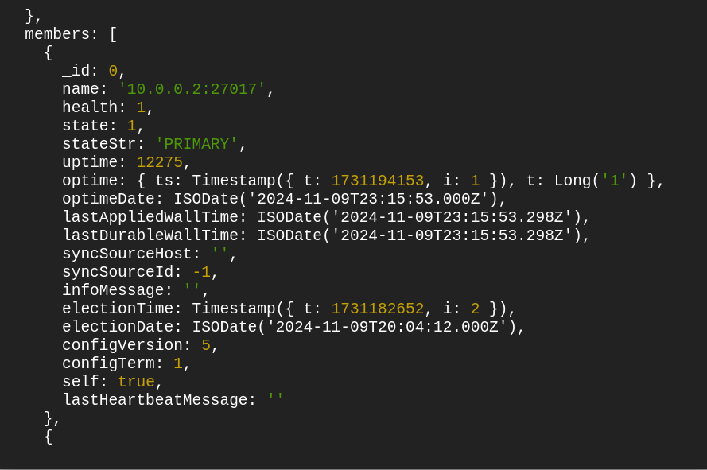
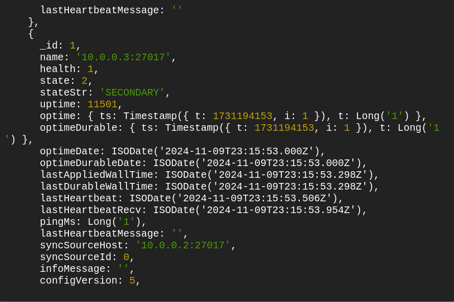
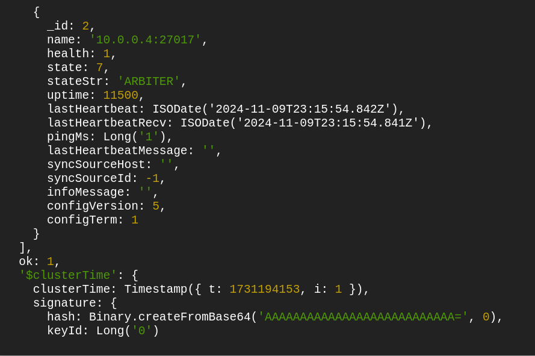

# WideOp's Terraform and GCP Peoject


Hey Amir and the rest of the team in WideOps
I created a highly available and fault tolerant MongoDB replica set and GKE cluster on sperate private subnets providing a secure and isolated environments all using terraform and gcp, and here is how i did it:

## Terraform Preparations

1. I created a **Cloud Storage** to store the .tfstate file securely and preventing it from being corrupted or destroyed with **Bucket Lock** and **Versioning** enabled
2. I created a Service Account with the **least privilege** principle allowing it to access and deploy only to the neccessary resources for this specific Terraform project, such as Compute Admin to deploy the MongoDB instances and the Bastion Host, Compute Netwrok Admin to deploy the VPC, private and public subnets and NAT Gateway. and Kubernetes Engine Admin and Kubernetes Engine Admin to create the GKE cluster, and also Storage Obejct Creator to create the new version of the tfstate file
3. I seperated each component of the project into modules
    #### Project Directory Structure:
    ```bash
    ├── k8s/                        
    │
    ├── tf/                         
    │   ├── main.tf                 
    │   ├── variables.tf            
    │   ├── locals.tf              
    │   ├── modules/
    │   │   ├── common/           
    │   │   │   ├── main.tf  # VPC, private and public subnets, NAT Gateway, Bastion Host       
    │   │   │   ├── variables.tf    
    │   │   │   ├── outputs.tf       
    │   │   │   └── data-sources.tf 
    │   │   ├── gke/                 
    │   │   │   ├── main.tf  # GKE Cluster         
    │   │   │   ├── variables.tf    
    │   │   │   ├── outputs.tf      
    │   │   │   └── data-sources.tf  
    │   │   ├── mongodb/             
    │   │   │   ├── main.tf  # MongoDB ReplicaSet   
    │   │   │   ├── variables.tf     
    │   │   │   ├── outputs.tf       
    │   │   │   └── data-sources.tf  
    │   │   │   ├── scripts/        
    │   │   │   │   ├── startup-mongo.sh  
    │   │   │   │   └── initiate-mongo.sh 

4. I understand that in production the setup would be different, I planned to create a landing zone that ensures each resource type (MongoDB, GKE, shared VPC) is housed within its own project, ensuring   resource isolation and fine-grained IAM control. This setup would involve creating four dedicated service accounts, each adhering to the least privilege principle for specific roles, and binding each account to the necessary project to enhance security and maintainability.
    
I understand that in production this is the procedure i would make

## The Networking Aspect - /modules/common

In this module, I created everything (almost) related to the Network:

### The VPC and Subnets

I created a vpc with the VPC resource, as well of three different subnets, **Two private subnets** for the GKE cluster and the MongoDB replicaset each. **One public subnet** for the Bastion Host for being able to SSH to the MongoDB replicaset and the GKE Nodes

each subnet had a different CIDR range to ensure there are no **overlapping ranges**. The MongoDB CIDR range is **10.0.0.0/24** , the GKE subnet has a **primary** CIDR range of **10.0.1.0/24** and two secondary CIDR ranges, one for the pods with a CIDR **10.0.2.0/25** and one for the services **10.0.2.128/25**. The public subnet has a CIDR range of **10.0.3.0/24**

### NAT Gateway

I created a NAT Gateway to ensure all the instances in the private subnets have access to outbound traffic, the NAT Gwateway was created with a **Cloud Router** as it acts as a traffic director and required to run a  NAT Gateway. i also attached the NAT Gateway with a **static IP** for future logging of whitelisting if necessary.


### Bastion Host

To connect to the replicaset and the GKE cluster that are in the private subnet i created a Bastion Host on the public subnet.

The Bastion Host a key pair stored locally that i set on the metadata as a familiar public key on the /.ssh/authorized_key file.

I also used **two provisioner** to transfer the private key of the MongoDB replicaset and the GKE nodes into the Bastion Host, the bastion host is open to port 22 and 80 with a dedicated **firewall rule**. 

*Identity-Aware Proxy (IAP) could be considered as a future alternative for more simplified, secure access.*

## The GKE Cluster - /modules/gke

### **`google_container_cluster`**:

The cluster is set to be highly available, the cluster will be deployed on two different zones configured with data sources. I added a fluentd pod for future logging and, i turned on the horizontal poding autoscaling option as it is not available by default. The control plane is set to the regular release version. 

### **`google_container_node_pool`**:

I created two node pools, one is **`general`**: containing two persistent nodes, on two different zones, ensuring reliablity and fault tolerant architecture.
Another node pool **`spot`**: with an auto scaling of 0 to 3, ensuring high availablity with lower cost and since there is already a persistent node pool, it is possible to execute.

All node pools configured with a key and a a firewall rule for the bastion host on port 22.

## The MongoDB Replica Set - /modules/mongodb

For the MongoDB replica set, i created two firewall rules, one is on port 22 for the bastion host privtate ip and another for the MongoDB itself on port 27017 accepting only traffic from inside the VPC on the range of 10.0.0.0/16

I created a **`google_compute_instance`** resource with a **`count=3`** (one primary, one secondary and one arbiter), each replica deployed on a different zone with the **`google_compute_zones`** data source. The instances deployed on a private subnet, with a unique key pair.

### **`startup-mongo.sh`**:

this script downloads MongoDB with the **`wget`** and command and **`apt`** . after MongoDB is downloaded on all 3 instances, the script echo the replica set's name to each instance making sure they are all under the same replica set with the **`tee -a`** , after that i use the **`sed -i`** command to replace the bindIp.

### resource  **`template_file`** and resource **`local_file`**:

Using the `join()` function, I created a template that generates the environment variable the Node app needs to connect to the MongoDB replica set as a single entity.

### resource **`null_resource`**

In this null resource, i created two provisioners. one to transer a local script to the Bastion Host and another one to remote exec it, here is how the script goes:

-  ### `initiate-mongo.sh`:

    Because the MongoDB cluster is in a private subnet we will need to SSH to it from the Bastion Host, I gave the right permissions to the MongoDB key and SSH to the one we set as primary before. to initiate the database, I firstly ran the `rs.initiate()` command.
    
    then set the RWConcern to 1 with w: "majority to allow balance performance and data consistency between the replica set.

    i then added the Secondary member to the replica set with the `rs.add()` command.

    While creating the script, i realized that i have a problem setting the primary insatnce as the host of the replica set so i reconfigured the replica set and after that added the Arbiter with the `rs.addArb()` command

At the end the MongoDB Replica Set should look like this:






*In production, we will set a username and a password for the database*


## The Node App - /node

### **`nodeapp.js`**:

I added few additional steps to the nodeapp.js:
1. I created an enviroment variable that the user add the docker image/k8s deployment with. This env var contains the IP's of all the replica set members, the selected database the app will send data to and the name of the replicaset itself
2.  I added a `/healthy` function that returns OK if the status code is <span style="color: green;">200</span> . this function will be later used by the nodeapp deployment's  **liveness probe** to ensure repeated if the pods are dead or alive.
3. I added a `/ready` fucntion that returns Ready if the status code is <span style="color: green;">200</span> and Not ready if the status code is <span style="color: red;">500</span>. this function will be later used by the **readiness probe** to check if a pod is ready to accept data or not

### **`Dockerfile`**:

The docker file i created is running on a node.js environment, it is exposed to **port 3000** and waits to get a env var from the user (MONGO_URI)

## The GKE Cluster - /k8s

### **`configmaps/mongouri.yml`**:

To store variables that are not confidential we will use a configMap. This configMap stores the value of the MongoDB replicaset IPs, the database name, and the replicaset name.


### **`secrets/tlscert.yml`**:

To store variables that are confidential such as credentials or keys we will use a kind called secret, the values in a secret must be **base64 coded** before being provided to the yaml file. this file contains the tls certification and the tls key, both base64 coded.

### **`deployments/depl-nodeapp.yml`**: 

This deployment is resposible for deploying the replicaset and the pods of the node application, the container port is set on 3000.

The deployment file has few other parameters

1. `resources:` Because the application is not very heavy and demanding resource wise, i decided to set a limit for each pod so multiple pods can run simultaneously on the same node if necessary, saving money and resources.
2. `livenessProbe:` This probe continuously checks if the pod is, if a pod is not responding, the **kubelet** get noticed and alert the API server that talks with the Controller Manager to schedule a new pod launch.
3. `readinessProbe:` This probe checks if a pod is ready to accept traffic, it gives it enough time to initiate before sending traffic to it. if a container fails over the accepted amount of times the container will beexcluded from the Service's endpoints.
4. `env:` This environment variable gets his value from the configMap we created earlier.

### **`services/service-nodeapp.yml`**: 

This service is an internal service from the **ClusterIP** type and it will only be accessable from inside of the cluster

The `port:` of the service is 80, which means the port is exposed to other services and ingresses on port 80
The `targetPort:` of the service is 3000, this means the service forward traffic coming from port 80 to port 3000 (Our node application)

### **`ingress/ingress.yml`**: 

on the ingress level we have few main features:

 `annotations:`
- every HTTP traffic is automatically redirected to HTTPS.
- every request coming from the website will reach the root (/) when it reachs the backend of the application

every request coming on the host forthebecks.magvonim. will be fowarded to port 80

`tls:`
-  The tls certificate we will soon create will be placed here

### **`ingress/ingressvalues.yml`**: 

This is the values file of the ingress-ngnix controller we will soon install from helm

in this values file we tell some really important stuff to the controller:
1.  `podAntiAffinity:` ensures that ingress controller pods are not schuduled on the same node, it's important for high availability and spreading the load across nodes.
2. `cloud.google.com/load-balancer-type: External:` specifies that the ingress controller's service should be exposed using an external Google Cloud load balancer.

### **`horizontal-nodeapp.yml`**: 

This is yaml file creates a horizontal pod autoscaling based of average CPU utilization if it exceed 70%, a new pod will be scheduled. the minimum number of pods is set to 2 and the maximum to 10 as requested

### **`network-policy-nodeapp.yml`**: 

This is a pod level network policy that only allows incoming traffic on port 3000 from any other pod and service in the same namespace, the outbound traffic is set on port 27017 to all the VPC CIDR range.

## Let's run this project together

First, we will need to create three different keys one for the Bastion Host, The MongoDB replica set and the GKE cluster, Recommended to save all keys in the same file to avoid complexity.

````bash
ssh-keygen -t rsa -b 2048 -f /path/to/file/bastion-host-key.pem
ssh-keygen -t rsa -b 2048 -f /path/to/file/gke-key.pem
ssh-keygen -t rsa -b 2048 -f /path/to/file/mongodb-key.pem
````

After that we will create our service account following the least privilege principle: **Compute Admin** to deploy the MongoDB instances and the Bastion Host, **Compute Netwrok Admin** to deploy the VPC, private and public subnets and NAT Gateway. and **Kubernetes Engine Admin** and **Kubernetes Engine Admin** to create the GKE cluster, and also **Storage Obejct Creator** to create the new version of the tfstate file. We will create a key file with a JSON format

Now we will run the following command:

````bash
 export GOOGLE_APPLICATION_CREDENTIALS="/path/to/file/key.json"
````

Now we are ready to run the terraform apply command:

````bash
 terraform apply
````

When terraform is done, which should take around 15-20 minutes we will a GKE cluster endpoint in our own local machine:
````bash
gcloud container clusters get-credentials nodeapp --region <selected-region-zone> --project <project-name>
````
Now when we run the `kubectl get nodes` command we should get this
````bash
NAME                       READY   STATUS    RESTARTS   AGE
nodeapp-6d4b696fb4-49kc5   1/1     Running   0          4m29s
nodeapp-6d4b696fb4-fc6tv   1/1     Running   0          4m29s
````
You will now need to create your tls self signed certificate for your domain, after running the command you will need to mention your 2 letter country code, satate or province name, city, organization name, the department and the domain it self
````bash
openssl req -new -newkey rsa:4096 -x509 -days 365  -nodes -out <certificate-name> -keyout <key-name>
````
Now run the base64 enctyption on both the certificate and the key and apply the outputs in the `k8s/secrets/tlscrt.yml` file :
````bash
base64 path/to/your/crt.crt
base64 path/to/your/key.key
````
From the file `configmapenv.txt` that was generated by terraform, take the output and apply it in `k8s/configmaps/mongouri.yml`, the output shoud look something like this:
````bash
mongodb://10.0.0.2:27017,10.0.0.3:27017,10.0.0.4:27017/mydb?replicaSet=rsu
````

Let's configure the cluster together, we will start with the configMap and secret file first

````bash
kubectl apply -f k8s/secrets/tlscrt.yml
kubectl apply -f k8s/configmaps/mongouri.yml
````

After that we will run the Service, Deployment, The pod Network Policy and the Horizontal Pod Autoscaler

````bash
kubectl apply -f k8s/deployment/depl-nodeapp.yml
kubectl apply -f k8s/services/service-nodeapp.yml
kubectl apply -f k8s/network-policy-nodeapp.yml
kubectl apply -f k8s/horizontal-nodeapp.yml
````
Now let's install the Ingress Controller from Helm:

````bash
helm repo update
helm install nodeapp -f k8s/ingress/ingressvalues.yml ingress-nginx/ingress-nginx --namespace ingress-nginx --create-namespace

````

We will run the ingress now, change the value to your full domain name:
````bash
kubectl apply -f k8s/ingress/ingress.yml 
````
And run `kubectl get ingress` and take the address and create an A record that will point out the load balancer's public IP (For some reason the GCP Cloud DNS zone did not work for me while i was able to create an AWS Hosted Zone so i created the A record there) it will look like this:
```bash
kubectl get ingress
NAME              CLASS            HOSTS                       ADDRESS         PORTS     AGE
nodeapp-ingress   external-nginx   forthebecks.magvonim.site   34.55.151.252   80, 443   88s
```
